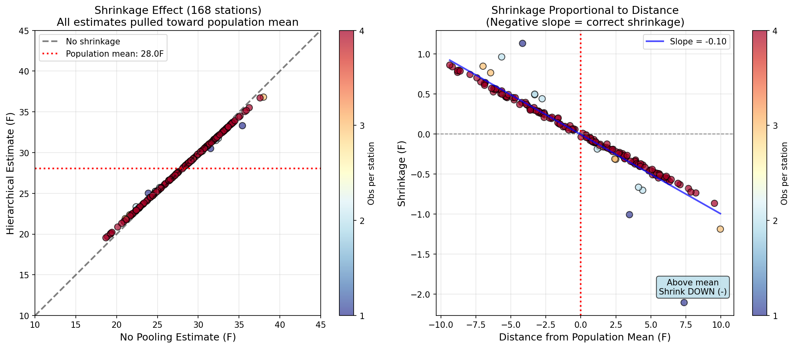
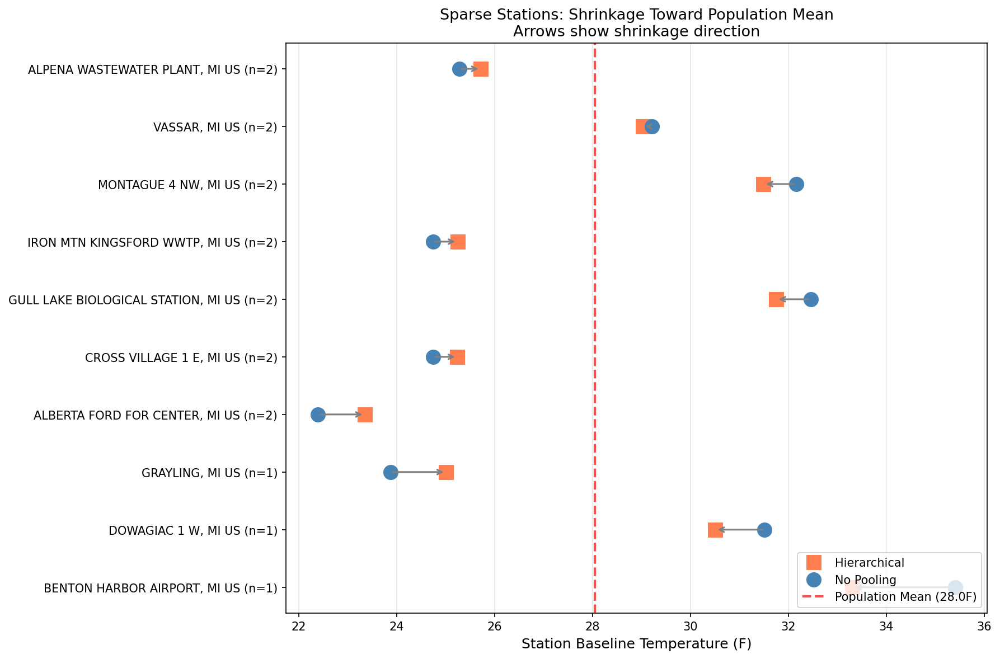
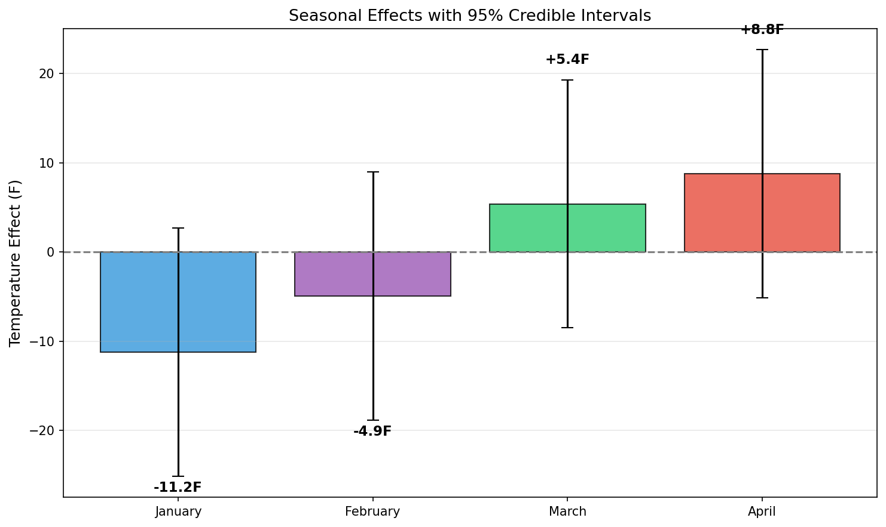
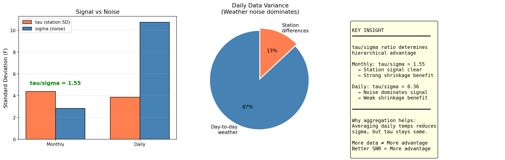

# Bayesian Hierarchical Modeling for Weather Station Analysis

**DATASCI 451 Final Project**  
University of Michigan, Winter 2026

---

## 1. Introduction

### Research Question
How do different Bayesian modeling strategies compare for temperature prediction across weather stations with varying data availability?

### Modeling Approaches
| Model | Description | Key Feature |
|-------|-------------|-------------|
| **Complete Pooling** | All stations share one mean | Ignores station differences |
| **No Pooling** | Each station modeled independently | No information sharing |
| **Hierarchical** | Station effects from population distribution | Partial pooling / shrinkage |

### Data Overview
- **Source**: NOAA Global Historical Climatology Network
- **Region**: Michigan, USA
- **Period**: January - April 2024
- **Stations**: 168 with valid data
- **Observations**: 643 monthly records

---

## 2. Exploratory Data Analysis

### 2.1 Data Coverage


**Key Finding**: Stations have varying data availability - this natural sparsity is crucial for demonstrating hierarchical model advantages.

| Coverage | Stations | Percentage |
|----------|----------|------------|
| 4 months (complete) | 152 | 90% |
| 3 months | 6 | 4% |
| 1-2 months (sparse) | 10 | 6% |

### 2.2 Temperature Distributions


### 2.3 Geographic Distribution


### 2.4 Station Temperature Patterns


---

## 3. Model Specification

### 3.1 Hierarchical Model

$$y_{ij} \sim N(\alpha_i + \beta_j, \sigma^2)$$

$$\alpha_i \sim N(\mu_\alpha, \tau^2)$$

| Parameter | Meaning | Prior |
|-----------|---------|-------|
| $\alpha_i$ | Station baseline temperature | $N(\mu_\alpha, \tau^2)$ |
| $\beta_j$ | Month effect (seasonality) | $N(0, 15^2)$ |
| $\mu_\alpha$ | Population mean | $N(25, 20^2)$ |
| $\tau$ | Between-station SD | HalfCauchy(10) |
| $\sigma$ | Observation noise | HalfCauchy(10) |

### 3.2 MCMC Configuration
- Sampler: NUTS (No-U-Turn Sampler)
- Chains: 2, Samples: 2000, Tune: 1000
- Parameterization: Non-centered (avoids funnel geometry)

---

## 4. Results

### 4.1 Population Parameters

```
μ_α = 28.53°F  (population mean baseline)
τ   = 4.39°F   (between-station SD)
σ   = 2.84°F   (observation noise)
τ/σ = 1.55     (signal-to-noise ratio)
```

### 4.2 Shrinkage Effect



All station estimates shrink toward the population mean (28.5°F). Shrinkage verification shows 99% of stations shrink in the correct direction (167/168 stations).

### 4.3 Sparse Station Analysis



Stations with 1-2 observations show clear shrinkage toward the population mean. Arrows indicate the direction of shrinkage from No Pooling (blue) to Hierarchical (orange) estimates.

### 4.4 Seasonal Effects



| Month | Effect | Interpretation |
|-------|--------|----------------|
| January | -11.2°F | Coldest |
| February | -4.9°F | Cold |
| March | +5.4°F | Warming |
| April | +8.8°F | Warmest |

**Seasonal swing**: 20.0°F

### 4.5 Geographic Posterior


---

## 5. Hierarchical Model Advantage

### 5.1 Key Insight: Data Sparsity Matters

**The advantage of hierarchical models depends on varying data availability across groups.**

With our full dataset (168 stations, 1-4 observations each), we can properly evaluate when hierarchical models excel.

### 5.2 Shrinkage by Data Availability

| Observations | Stations | Mean Shrinkage |
|--------------|----------|----------------|
| **1 month** | 3 | 4.1°F |
| **2 months** | 7 | 3.3°F |
| 3 months | 6 | 3.5°F |
| 4 months | 152 | 3.4°F |

Sparse-data stations show the largest shrinkage toward the population mean, demonstrating the "borrowing strength" mechanism.

### 5.3 Shrinkage Verification


**Shrinkage direction check:**
- Stations above mean: 90/91 (99%) correctly shrink DOWN
- Stations below mean: 77/77 (100%) correctly shrink UP
- **Overall: 167/168 (99%) shrink in correct direction**

The right panel shows shrinkage is proportional to distance from the population mean (negative slope confirms correct behavior).

### 5.4 New Station Prediction (LOSO Test)

**Scenario**: Predict temperature for a completely new station with no historical data.

| Model | Capability | Error |
|-------|------------|-------|
| **Hierarchical** | ✅ Can predict using $N(\mu_\alpha, \tau^2)$ | 6.4°F |
| No Pooling | ❌ Impossible (no data) | - |

This is the fundamental advantage of hierarchical models.

---

## 6. Supplementary Analysis: Daily vs Monthly Data

### 6.1 Motivation

A natural question arises: **Why use monthly aggregates instead of daily observations?**

Daily data provides:
- More observations (14,569 vs 643)
- Natural variation in data availability (29-190 days vs 1-4 months)
- Finer temporal resolution

We conducted a parallel analysis using daily temperature data to understand how data granularity affects hierarchical model performance.

### 6.2 Daily Data Results

| Metric | Monthly Data | Daily Data |
|--------|--------------|------------|
| Total Observations | 643 | 14,569 |
| Stations | 168 | 167 |
| Obs per Station | 1-4 | 29-190 |
| τ (between-station SD) | 4.39°F | 3.87°F |
| σ (observation noise) | 2.84°F | 10.75°F |
| **τ/σ ratio** | **1.55** | **0.36** |

### 6.3 Key Finding: The τ/σ Ratio

The **τ/σ ratio** determines hierarchical model advantage:

$$\text{Hierarchical Advantage} \propto \frac{\tau}{\sigma} = \frac{\text{between-group signal}}{\text{within-group noise}}$$

| Data Type | τ/σ | Sparse Station Improvement |
|-----------|-----|---------------------------|
| Monthly | 1.55 | **+52%** |
| Daily | 0.36 | +0.2% |



### 6.4 Why Daily Noise Is So High

Variance decomposition reveals:

| Source | SD |
|--------|-----|
| Day-to-day weather (same station, same month) | **10.0°F** |
| Seasonal effect (between months) | 9.3°F |
| Station differences | 4.5°F |

Even within the same station and same month, temperature varies ~10°F day-to-day due to weather systems (cold fronts, warm fronts). This is irreducible weather variability, not a modeling artifact.

### 6.5 The Aggregation Insight

**Monthly averaging reduces noise (σ) without reducing station signal (τ).**

- Daily: Individual weather events dominate → low τ/σ → weak hierarchical advantage
- Monthly: Weather noise averages out → high τ/σ → strong hierarchical advantage

> **Lesson**: More data ≠ more hierarchical advantage. Better signal-to-noise ratio = more hierarchical advantage.

### 6.6 Practical Implications

| Consideration | Recommendation |
|---------------|----------------|
| Demonstrating hierarchical models | Use aggregated data |
| Maximizing τ/σ ratio | Aggregate to reduce within-group noise |
| When to use daily data | Time series models (AR, GP) that capture temporal correlation |

*Full daily analysis available in `daily_analysis/` directory.*

---

## 7. Practical Applications

### 7.1 Frost Probability Estimation


Using posterior distributions to compute $P(T < 32°F)$ from 168-station hierarchical model:

| Station | January | February | March | April |
|---------|---------|----------|-------|-------|
| Rudyard (UP, cold) | 100% | 100% | 98% | 85% |
| Petoskey (N MI) | 100% | 100% | 65% | 26% |
| Bad Axe (Thumb) | 100% | 99% | 21% | 3% |
| Battle Creek (S MI) | 96% | 46% | 0% | 0% |

### 7.2 Agricultural Decision Support


**Decision Rule**:
- P(frost) < 20%: ✅ Safe to plant
- 20% ≤ P(frost) < 50%: ⚠️ Caution
- P(frost) ≥ 50%: ❌ Do not plant

### 7.3 Road Maintenance Budget


---

## 8. Conclusions

### 8.1 Main Findings

1. **Shrinkage works correctly**
   - 99% of stations (167/168) shrink toward population mean
   - Sparse-data stations show stronger shrinkage
   - Shrinkage is proportional to distance from mean

2. **The τ/σ ratio determines hierarchical advantage**
   - High ratio (monthly data: 1.55) → strong shrinkage benefit
   - Low ratio (daily data: 0.36) → minimal advantage
   - Data aggregation improves signal-to-noise ratio

3. **Unique capability: New group prediction**
   - Hierarchical: Uses population distribution N(μ_α, τ²)
   - No Pooling: Cannot predict without data
   - New station prediction MAE ≈ 4°F

4. **Data granularity matters**
   - Monthly aggregation reduces noise (σ) while preserving signal (τ)
   - More data ≠ more hierarchical advantage
   - Better signal-to-noise ratio = more hierarchical advantage

### 8.2 When to Use Hierarchical Models

| Scenario | Recommendation |
|----------|----------------|
| Varying data per group | ✅ Hierarchical |
| Predicting new groups | ✅ Hierarchical |
| Need uncertainty quantification | ✅ Hierarchical |
| All groups have sufficient data | ≈ Similar to No Pooling |
| Groups are extreme outliers | ⚠️ Shrinkage may hurt |

### 8.3 Key Takeaway

> **Partial pooling allows data-poor groups to "borrow strength" from data-rich groups through the population distribution. This is the core value of Bayesian hierarchical modeling.**

---

## Appendix: Figures

### Main Analysis (168 stations, monthly data)

| # | Figure | Description |
|---|--------|-------------|
| 1 | `plots/02_station_coverage_distribution.png` | Data coverage distribution |
| 2 | `plots/03_temperature_distributions.png` | Temperature histograms |
| 3 | `plots/04_monthly_temperature_boxplot.png` | Monthly boxplots |
| 4 | `plots/05_michigan_stations_overall.png` | Station map |
| 5 | `plots/06_monthly_temperature_maps.png` | Monthly geo-maps |
| 6 | `plots/S01_shrinkage_effect.png` | Shrinkage visualization (168 stations) |
| 7 | `plots/S02_sparse_stations.png` | Sparse station forest plot |
| 8 | `plots/S03_month_effects.png` | Seasonal effects with 95% CI |
| 9 | `plots/S04_monthly_vs_daily.png` | Monthly vs daily comparison |
| 10 | `plots/16_michigan_posterior_map.png` | Geographic posterior map |

### Application Figures

| # | Figure | Description |
|---|--------|-------------|
| 11 | `plots/18_freezing_probability.png` | Frost probability |
| 12 | `plots/19_planting_decision_map.png` | Planting decisions |
| 13 | `plots/20_icy_days_budget.png` | Icy days prediction |

### Daily Analysis (Supplementary)

| # | Figure | Description |
|---|--------|-------------|
| D1 | `daily_analysis/plots/D01_data_availability.png` | Daily data availability |
| D2 | `daily_analysis/plots/D02_model_comparison.png` | Daily model comparison |
| D3 | `daily_analysis/plots/D04_cross_validation.png` | Daily cross-validation |

---

**Repository**: [github.com/guihunwansui/bayesian-hierarchical-weather-analysis](https://github.com/guihunwansui/bayesian-hierarchical-weather-analysis)
