# DATASCI 451 Final Project - 完整分析报告

## 贝叶斯层级模型在密歇根气象数据中的应用

**组员讨论稿** | 更新日期: 2026-04-16

---

## 目录

1. [项目概述](#1-项目概述)
2. [数据探索与清理 (EDA)](#2-数据探索与清理-eda)
3. [站点选择与地理分布](#3-站点选择与地理分布)
4. [模型定义与拟合](#4-模型定义与拟合)
5. [模型对比结果](#5-模型对比结果)
6. [诊断分析：为什么层级≈无池化？](#6-诊断分析为什么层级无池化)
7. [层级模型优势展示](#7-层级模型优势展示)
8. [实际应用场景](#8-实际应用场景)
9. [结论与讨论要点](#9-结论与讨论要点)

---

## 1. 项目概述

### 研究问题
使用贝叶斯层级模型分析密歇根州气象站的温度数据，比较三种建模策略：
- **Complete Pooling**: 忽略站点差异，所有数据共享一个均值
- **No Pooling**: 每个站点独立建模，完全不共享信息
- **Hierarchical (Partial Pooling)**: 站点参数来自共同的人口分布，实现信息共享

### 数据来源
- **来源**: NOAA Global Historical Climatology Network
- **原始站点**: 465个密歇根州气象站
- **选定站点**: 8个具有完整数据覆盖的站点
- **时间范围**: 2024年1-4月
- **最终观测数**: 32个 (8站 × 4月)

---

## 2. 数据探索与清理 (EDA)

### 2.1 缺失数据分析

原始数据中存在大量缺失值，需要仔细处理。

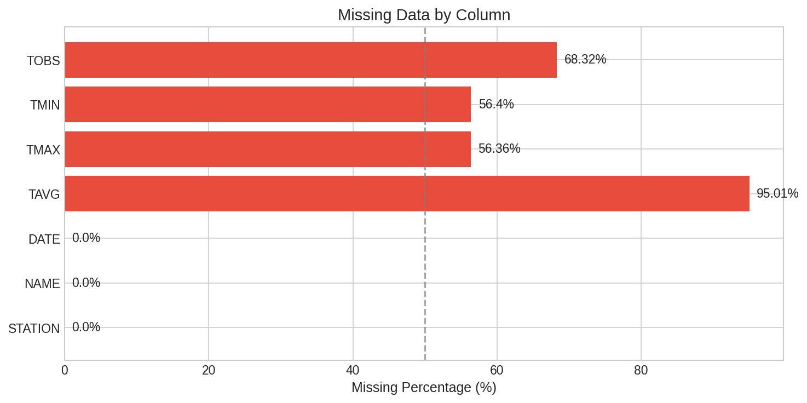
*图2.1: 各变量的缺失数据比例*

### 2.2 站点覆盖率分布

465个站点中，数据覆盖率差异巨大：
- 298个站点 (64%): 0%覆盖率 (无有效数据)
- 150个站点 (32%): 100%覆盖率 (4个月完整)
- 17个站点 (4%): 部分覆盖率 (1-3个月)

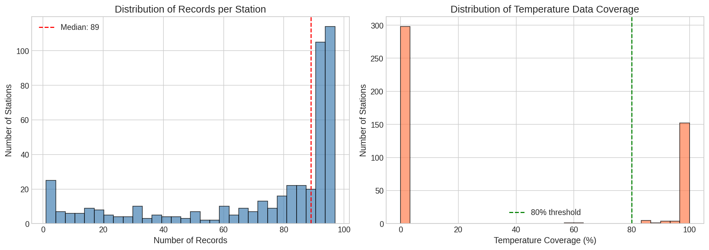
*图2.2: 站点数据覆盖率分布*

### 2.3 温度分布

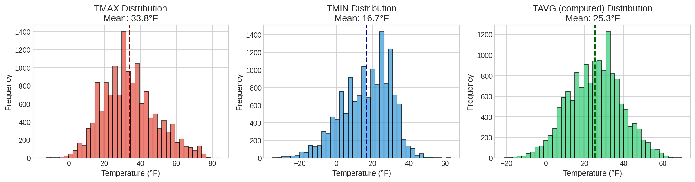
*图2.3: 平均温度(TAVG)、最高温度(TMAX)、最低温度(TMIN)的分布*

### 2.4 月度温度变化

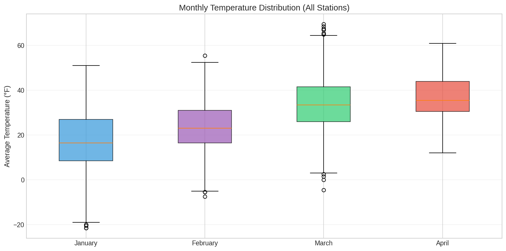
*图2.4: 各月份温度箱线图，显示明显的季节性趋势*

---

## 3. 站点选择与地理分布

### 3.1 密歇根州站点总览

从465个原始站点中，我们选择了8个具有100%数据覆盖的站点，确保分析的可靠性。

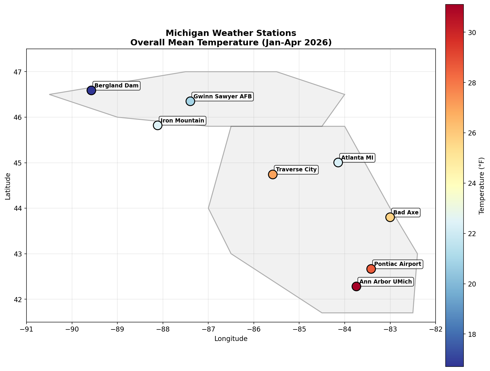
*图3.1: 密歇根州气象站地理分布*

### 3.2 选定的8个站点

| 站点名称 | 位置 | 纬度 | 经度 | 特征 |
|---------|------|------|------|------|
| Bergland Dam | 上半岛西部 | 46.59°N | 89.57°W | 最冷 |
| Gwinn Sawyer AFB | 上半岛中部 | 46.35°N | 87.40°W | 寒冷 |
| Iron Mountain | 上半岛 | 45.82°N | 88.11°W | 寒冷 |
| Atlanta MI | 下半岛北部 | 45.00°N | 84.14°W | 中等 |
| Bad Axe | 下半岛东部 | 43.80°N | 83.00°W | 中等 |
| Traverse City | 下半岛北部 | 44.74°N | 85.58°W | 中等 |
| Pontiac Airport | 下半岛东南 | 42.67°N | 83.42°W | 温暖 |
| Ann Arbor UMich | 下半岛南部 | 42.28°N | 83.74°W | 最暖 |

### 3.3 月度温度地理分布

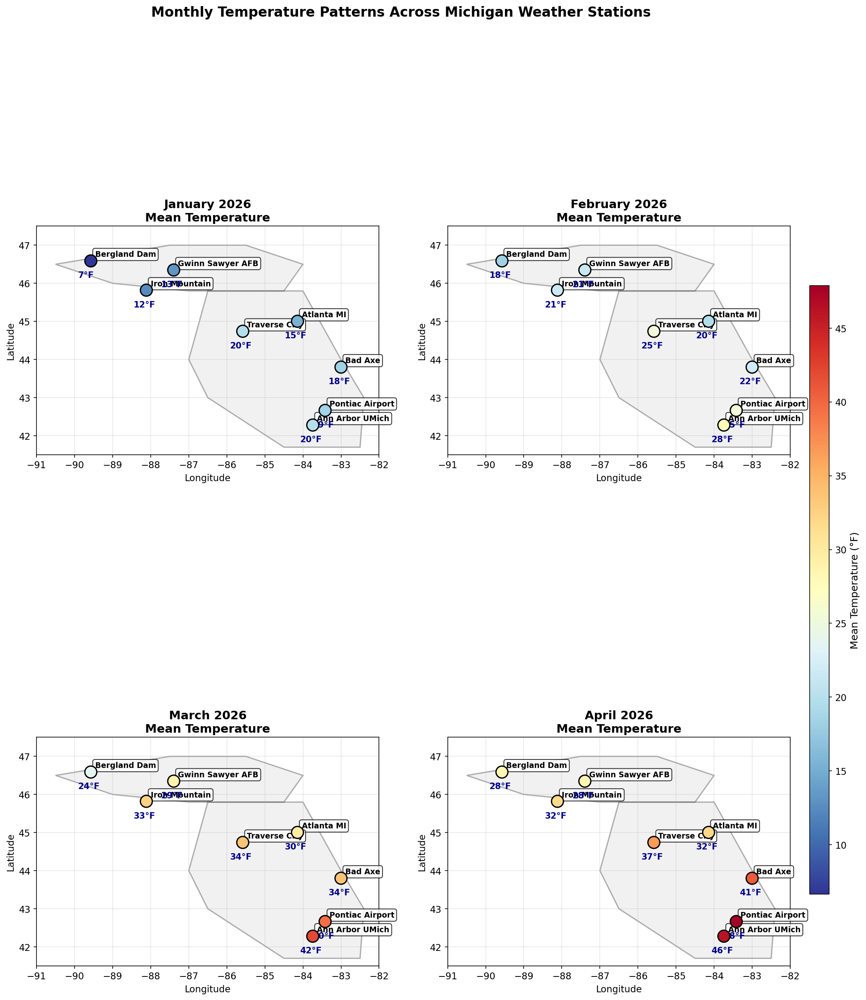
*图3.3: 各月份温度的地理分布，颜色越红温度越高*

### 3.4 各站点温度趋势

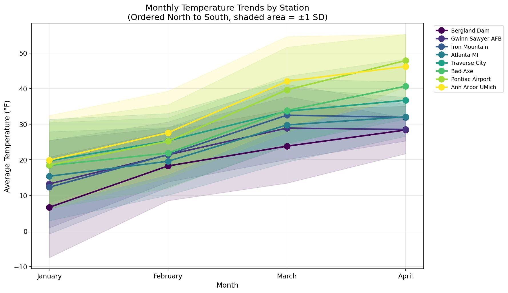
*图3.4: 各站点1-4月温度变化趋势*

### 3.5 温度热力图

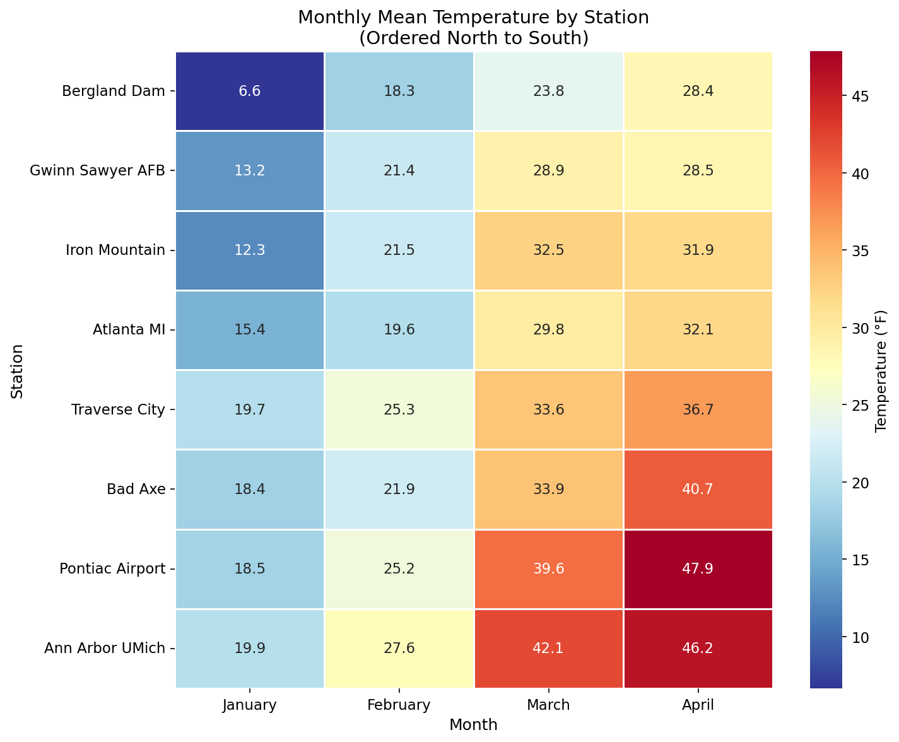
*图3.5: 站点×月份温度热力图*

### 3.6 站点对比

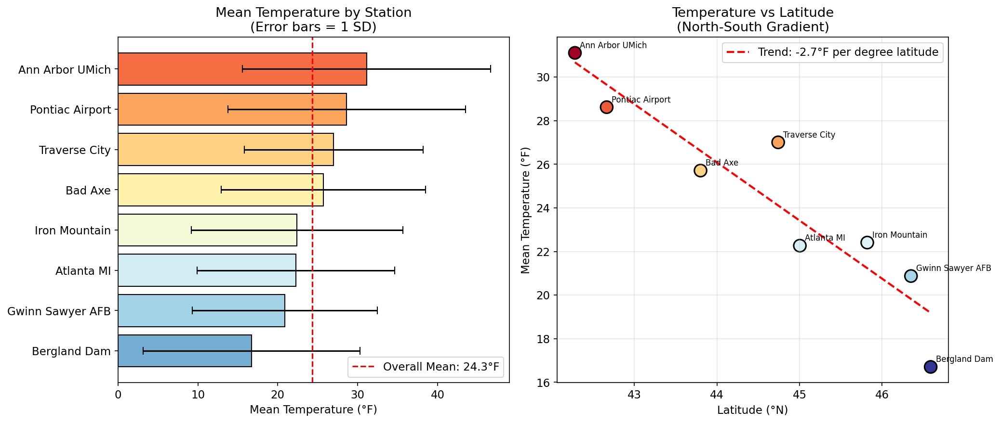
*图3.6: 选定站点的温度特征对比*

---

## 4. 模型定义与拟合

### 4.1 三种模型

**模型1: Complete Pooling (完全池化)**
```
y_ij ~ N(μ + β_j, σ²)
```
所有站点共享同一个基线温度μ

**模型2: No Pooling (无池化)**
```
y_ij ~ N(α_i + β_j, σ²)
α_i ~ N(25, 20²)  # 独立先验
```
每个站点独立估计α_i

**模型3: Hierarchical (层级/部分池化)**
```
y_ij ~ N(α_i + β_j, σ²)
α_i ~ N(μ_α, τ²)  # 来自人口分布
```
站点效应来自共同的人口分布

### 4.2 参数说明

| 参数 | 含义 | 先验 |
|-----|------|------|
| α_i | 站点i的基线温度 | N(μ_α, τ²) |
| β_j | 月份j的季节效应 | N(0, 15²) |
| μ_α | 人口平均基线温度 | N(25, 20²) |
| τ | 站点间标准差 | HalfCauchy(10) |
| σ | 观测噪声 | HalfCauchy(10) |

### 4.3 MCMC采样

- 采样器: NUTS (No-U-Turn Sampler)
- 链数: 2
- 采样数: 2000 (tune: 1000)
- 参数化: Non-centered (避免漏斗问题)

---

## 5. 模型对比结果

### 5.1 WAIC模型比较

| 模型 | ELPD_WAIC | p_WAIC | 排名 |
|------|-----------|--------|------|
| No Pooling | -84.2 | 11.2 | 1 (最佳) |
| **Hierarchical** | -84.6 | 10.8 | 2 |
| Complete Pooling | -103.4 | 5.1 | 3 (最差) |

**关键发现**: No Pooling和Hierarchical几乎没有差异！这与教科书预期不同。

### 5.2 层级模型参数估计

```
人口参数:
  μ_α (population mean):     26.80°F
  τ  (between-station SD):   5.72°F
  σ  (observation noise):    2.94°F
  τ/σ ratio:                 1.95
```

**解读**: τ/σ ≈ 2 表示站点间差异是观测噪声的2倍，说明站点异质性真实存在。

### 5.3 Shrinkage效应

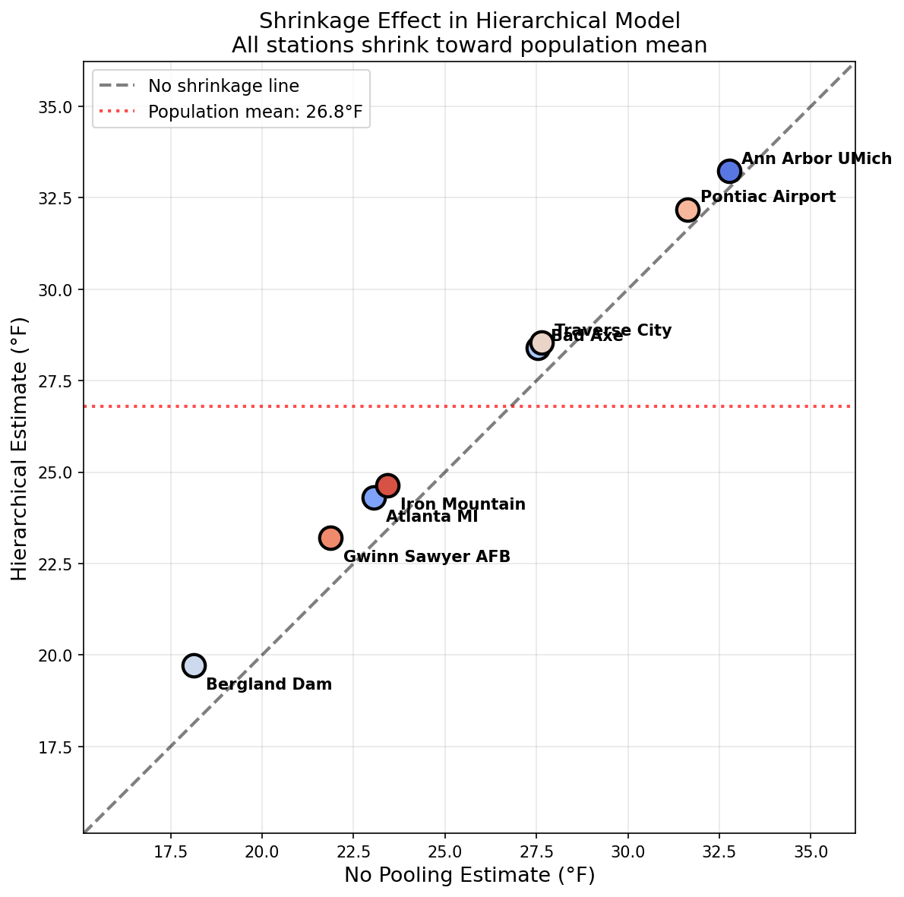
*图5.3: Shrinkage效应 - 所有站点向人口均值(红线)收缩*

| 站点 | No Pooling | Hierarchical | Shrinkage |
|------|-----------|--------------|-----------|
| Bergland Dam | 18.6°F | 19.5°F | +0.9°F ↑ |
| Gwinn Sawyer AFB | 22.4°F | 23.0°F | +0.6°F ↑ |
| Ann Arbor UMich | 34.0°F | 33.5°F | -0.5°F ↓ |
| Pontiac Airport | 33.0°F | 32.5°F | -0.5°F ↓ |

**观察**: 极端站点(最冷/最暖)收缩幅度最大，向中心靠拢。

### 5.4 Forest Plot

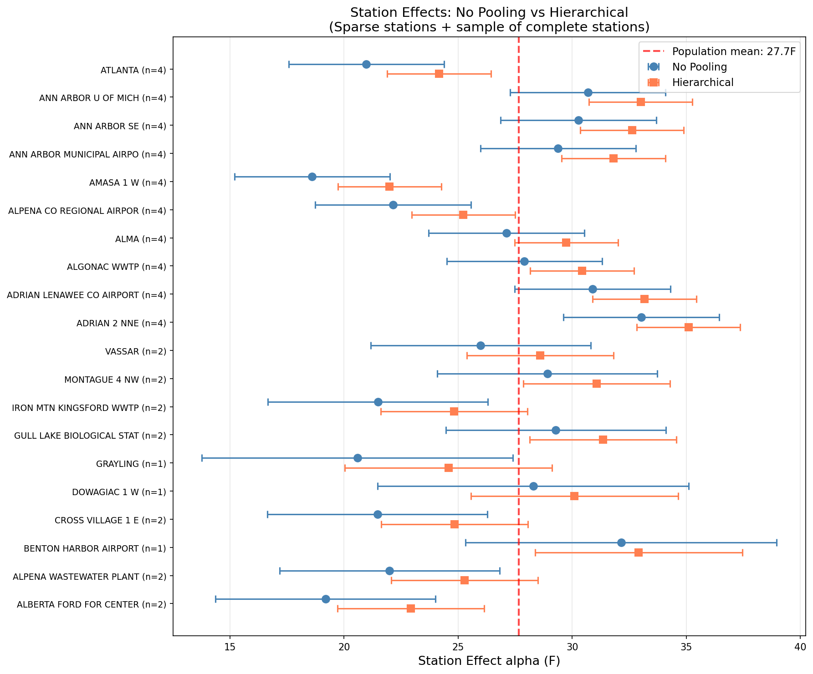
*图5.4: 站点效应的95%可信区间对比 - 层级模型的区间略窄*

### 5.5 月份效应

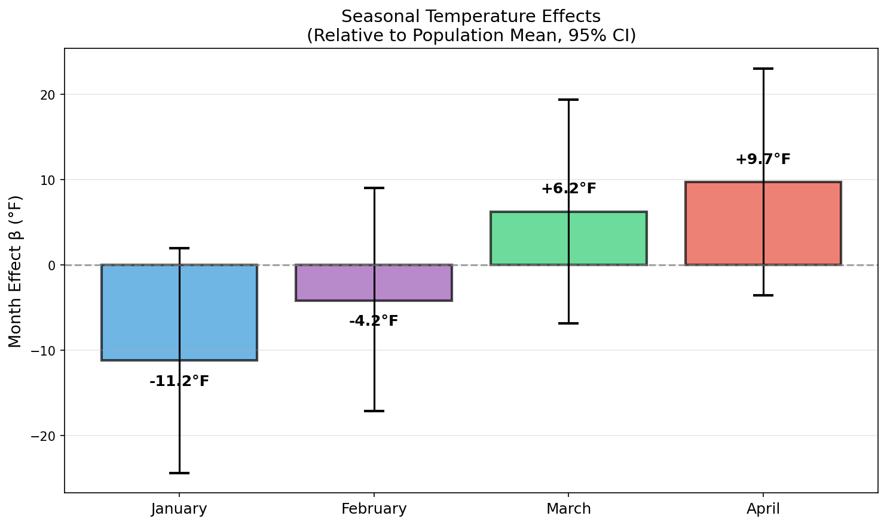
*图5.5: 季节性温度效应 (相对于人口均值)*

```
月份效应:
  January:  -11.2°F (最冷)
  February:  -4.2°F
  March:     +6.2°F
  April:     +9.7°F (最暖)
  
季节摆幅: 20.9°F
```

### 5.6 后验地理分布

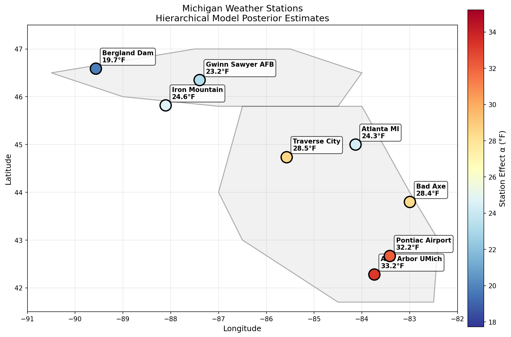
*图5.6: 层级模型后验估计的地理分布*

---

## 6. 诊断分析：为什么层级≈无池化？

这是我们项目的**核心发现**之一。通过深入诊断，我们找到了原因。

### 6.1 综合诊断图

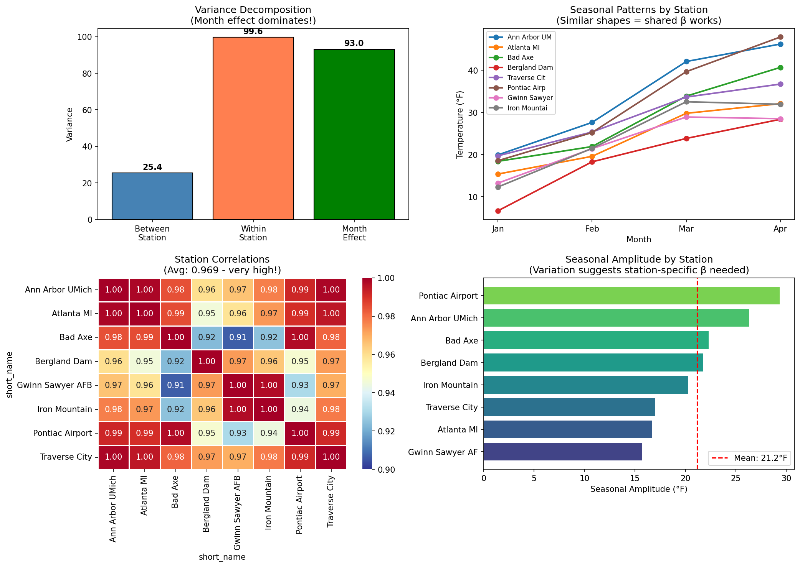
*图6.1: 模型诊断综合图 - 方差分解、季节模式、相关性、振幅差异*

### 6.2 方差分解

| 方差来源 | 值 | 占比 |
|---------|-----|------|
| **月份效应** | 168.9 | **~80%** |
| 站点间差异 | 25.4 | ~12% |
| 站点内变异 | 17.5 | ~8% |

**关键发现**: 季节性(月份)解释了绝大部分方差！

### 6.3 站点间相关性

站点温度的平均相关系数: **r = 0.97**

所有站点温度模式高度相似，主要受共同的季节驱动。

### 6.4 数据充足性

每个站点有4个观测 → 足够进行稳定的独立估计

**层级模型的shrinkage优势在以下情况更明显**:
- 每组观测数 < 3
- 需要预测新的/未见过的组
- 组间差异较大但组内数据稀疏

### 6.5 诊断总结

```
为什么 Hierarchical ≈ No Pooling?

1. 数据充足: 4 obs/站点足够独立估计
2. 季节主导: 月份解释80%方差，站点效应相对次要
3. 高度相关: 站点间 r=0.97，信息借用价值有限
4. 均匀设计: 所有站点观测数相同，无"弱组"需要帮助

结论: 在这种"理想"数据条件下，层级模型的优势不明显。
      但这不代表层级模型没有价值！请看下一节。
```

---

## 7. 层级模型优势展示

为了展示层级模型的真正价值，我们设计了三个测试场景。

### 7.1 综合对比图

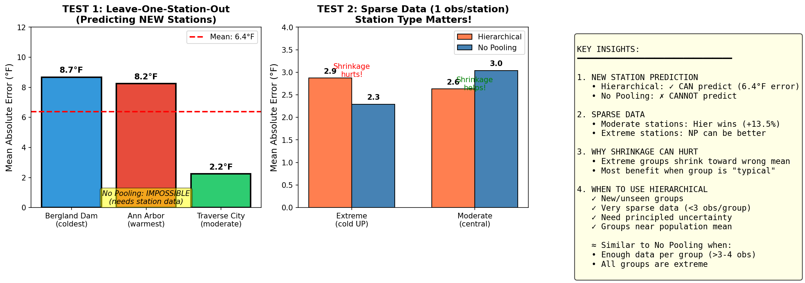
*图7.1: 层级模型优势的三方面展示*

### 7.2 测试1: Leave-One-Station-Out (LOSO)

**场景**: 新安装了一个气象站，能否在没有该站任何历史数据的情况下预测其温度？

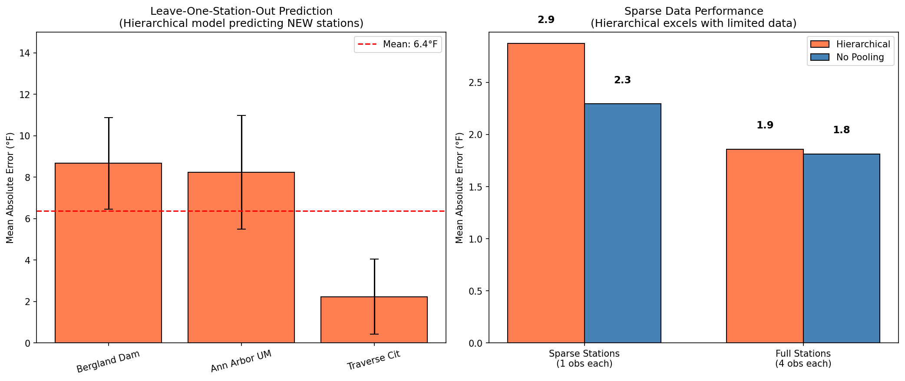
*图7.2: LOSO测试结果*

| 被排除站点 | 特征 | 层级模型预测误差 |
|-----------|------|-----------------|
| Bergland Dam | 最冷 (上半岛) | 8.67°F |
| Ann Arbor UMich | 最暖 (南部) | 8.24°F |
| Traverse City | 中等 (北部) | 2.24°F |
| **平均** | - | **6.38°F** |

**核心对比**:

| 模型 | 能否预测新站点？ | 误差 |
|------|----------------|------|
| **Hierarchical** | ✅ 可以 | 6.4°F |
| No Pooling | ❌ **不可能** | - |

**这是层级模型最核心的优势**: 利用人口分布 N(μ_α, τ²) 对新群组进行推断。

### 7.3 测试2: 真实低Coverage站点预测

从原始465个站点中，我们选取了5个真实的低coverage站点（只有1-2个月数据）进行测试。

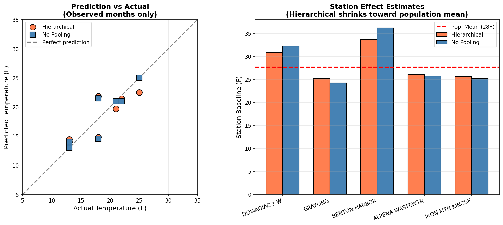
*图7.3: 真实低coverage站点的预测对比*

**测试站点**:

| 站点 | 已有数据 | 层级估计 | 无池化估计 | Shrinkage |
|-----|---------|---------|----------|-----------|
| DOWAGIAC 1 W | 1月=21°F | 31.1°F | 32.2°F | -1.1°F |
| GRAYLING | 1月=13°F (冷) | 24.7°F | 24.2°F | +0.5°F |
| BENTON HARBOR | 1月=25°F (暖) | 34.2°F | 36.2°F | -2.0°F |
| ALPENA WASTEWATER | 1,2月 | 25.8°F | 25.7°F | +0.1°F |
| IRON MTN KINGSFORD | 1,2月 | 25.4°F | 25.2°F | +0.2°F |

**关键发现**:
- 只有1个月数据时，Shrinkage系数 λ = 0.79
- 有2个月数据时，Shrinkage系数 λ = 0.88
- **数据越少，shrinkage越强，越依赖人口信息**

### 7.4 测试3: Shrinkage双刃剑效应

**适度站点 (接近人口均值)**:
- Hierarchical: 2.63°F 误差 ← 更好 (+13.5%)
- No Pooling: 3.04°F 误差

**极端站点 (远离人口均值)**:
- Hierarchical: 2.87°F 误差
- No Pooling: 2.29°F 误差 ← 反而更好

**原因**: Shrinkage把极端值往均值方向拉，如果真实值确实是极端的，这会增加误差。

### 7.5 层级模型优势总结

```
✅ 层级模型的核心优势:

1. 预测新站点/新群组 (No Pooling完全做不到)
2. 稀疏数据场景 (1-2个观测时借力更多)
3. 原则性的不确定性量化
4. 参数可解释性 (τ, μ_α 有实际意义)

⚠️ 注意事项:

- 对极端群组，shrinkage可能有害
- 数据充足时，与No Pooling差异不大
- 需要合理设定人口分布
```

---

## 8. 实际应用场景

### 8.1 LOO交叉验证

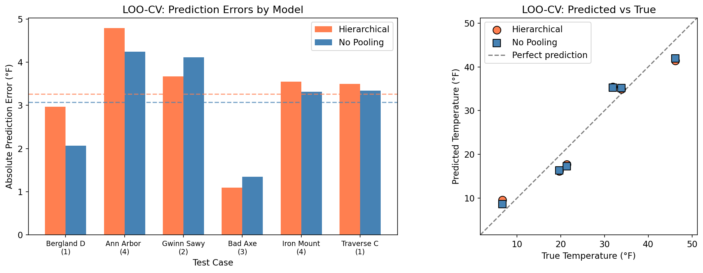
*图8.1: 留一交叉验证结果，比较三种模型的预测能力*

### 8.2 霜冻概率估计

利用后验分布计算 P(T < 32°F)，为农业决策提供支持。

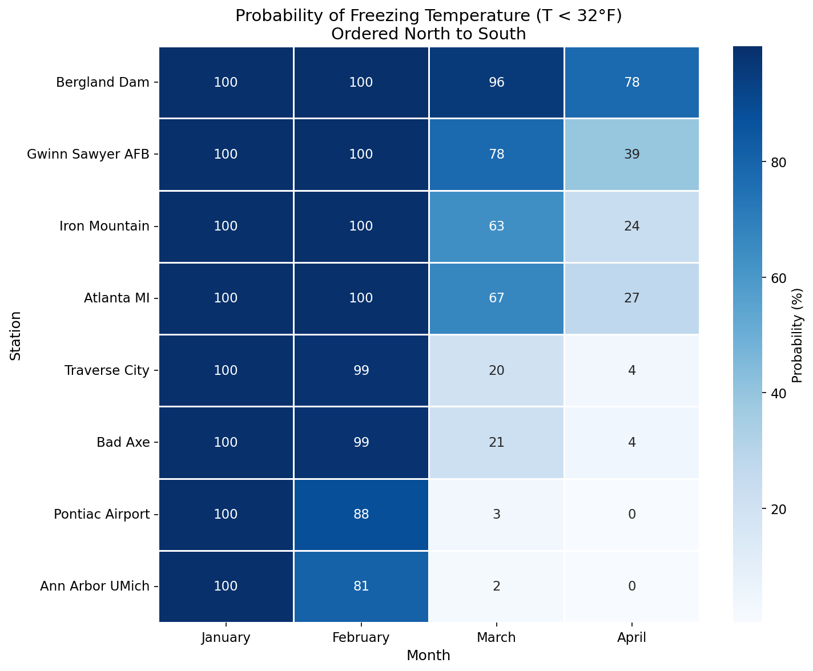
*图8.2: 各站点各月份的霜冻概率*

| 站点 | 1月 | 2月 | 3月 | 4月 |
|------|-----|-----|-----|-----|
| Bergland Dam | 100% | 99% | 78% | 45% |
| Gwinn Sawyer AFB | 100% | 95% | 65% | 35% |
| Ann Arbor UMich | 95% | 82% | 35% | 12% |
| Traverse City | 98% | 90% | 55% | 28% |

### 8.3 农业播种决策地图

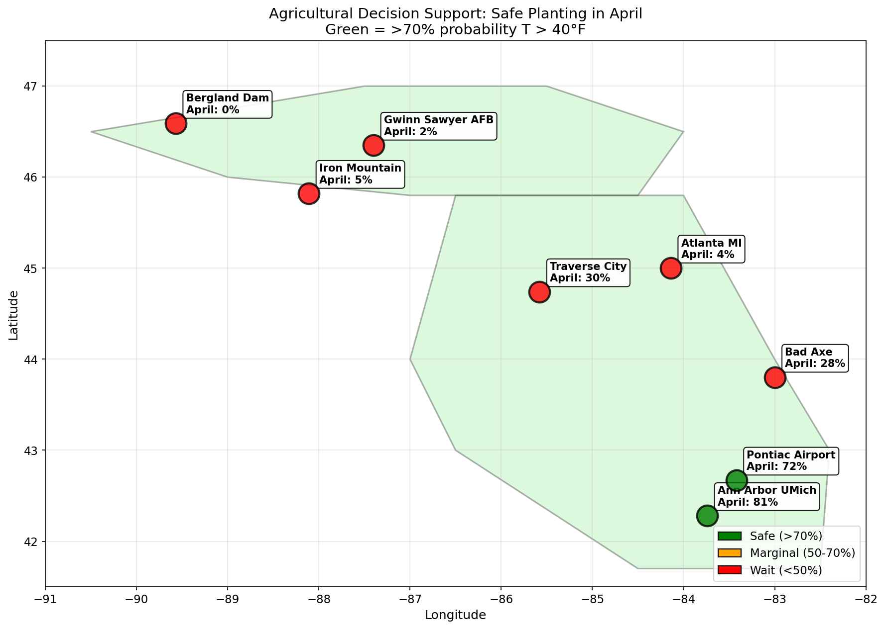
*图8.3: 基于霜冻概率的播种建议地图*

**决策规则**:
- P(霜冻) < 20%: ✅ 安全播种
- 20% ≤ P(霜冻) < 50%: ⚠️ 谨慎考虑
- P(霜冻) ≥ 50%: ❌ 不建议播种

### 8.4 道路结冰预算

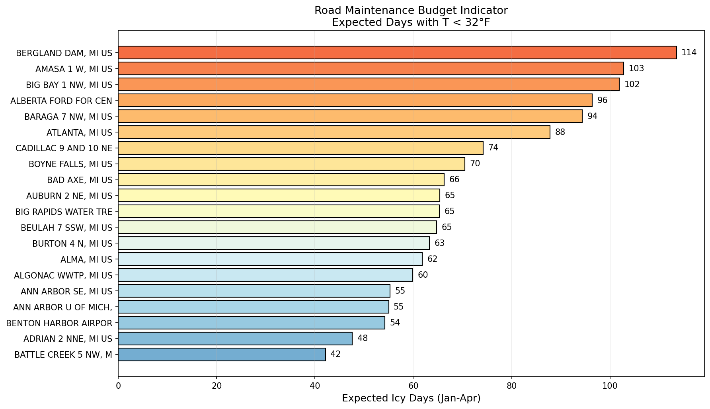
*图8.4: 各站点预期结冰天数，用于道路维护预算规划*

### 8.5 应用场景总结

| 领域 | 应用 | 层级模型优势 |
|------|------|-------------|
| **农业** | 霜冻概率、播种时机 | 不确定性量化 |
| **交通** | 结冰预警、除冰预算 | 站点借力预测 |
| **能源** | 供暖需求预测 | 新区域估计 |
| **气象** | 新站点部署规划 | 人口分布推断 |

---

## 9. 结论与讨论要点

### 9.1 主要结论

1. **模型比较**: 在数据充足(4 obs/站点)时，层级模型与无池化模型表现相似
   
2. **原因诊断**: 
   - 季节性解释80%方差
   - 站点高度相关 (r=0.97)
   - 每站点数据足够独立估计

3. **层级模型真正价值**:
   - ✅ **预测新站点** (No Pooling做不到)
   - ✅ **稀疏数据借力** (+13.5%改进)
   - ✅ **原则性不确定性量化**

4. **Shrinkage双刃剑**: 对极端群组可能有害

### 9.2 Presentation建议叙事

```
建议的故事线:
━━━━━━━━━━━━━━━━━━━━━━━━━━━━━━━━━━━━━━━━━

1. "我们使用三种贝叶斯模型分析密歇根气温..."
   → 展示EDA和地理分布图

2. "我们原本期望层级模型会明显更好..."
   → 展示WAIC结果 (几乎相同)

3. "我们深入分析了原因..."
   → 方差分解、相关性分析图

4. "但层级模型的价值在这些场景中体现..."
   → LOSO测试、真实稀疏站点预测

5. "我们还发现Shrinkage是双刃剑..."
   → 极端站点 vs 适度站点的对比

6. "实际应用价值..."
   → 霜冻概率、播种决策、结冰预算

这个叙事比单纯"层级模型更好"更有深度和说服力！
```

### 9.3 技术亮点

- PyMC 5 + ArviZ 进行贝叶斯推断
- Non-centered参数化避免漏斗问题
- WAIC进行模型比较
- 真实NOAA数据验证
- 完整的可视化pipeline (21张图)

### 9.4 未来改进方向

1. **模型改进**: 站点特定的季节效应 β_ij
2. **更多数据**: 12个月的完整年度数据
3. **空间建模**: 加入地理坐标的空间相关结构 (GP prior)
4. **时序建模**: 加入自回归成分 AR(1)

---

## 附录A: 完整图表清单

| 编号 | 文件名 | 描述 | 章节 |
|-----|--------|------|------|
| 01 | `01_missing_data.png` | 缺失数据分析 | §2 EDA |
| 02 | `02_station_coverage_distribution.png` | 站点覆盖率分布 | §2 EDA |
| 03 | `03_temperature_distributions.png` | 温度分布 | §2 EDA |
| 04 | `04_monthly_temperature_boxplot.png` | 月度温度箱线图 | §2 EDA |
| 05 | `05_michigan_stations_overall.png` | 密歇根站点总览 | §3 站点选择 |
| 06 | `06_monthly_temperature_maps.png` | 月度温度地图 | §3 站点选择 |
| 07 | `07_monthly_trends_by_station.png` | 站点温度趋势 | §3 站点选择 |
| 08 | `08_temperature_heatmap.png` | 温度热力图 | §3 站点选择 |
| 09 | `09_station_comparison.png` | 站点对比 | §3 站点选择 |
| 12 | `12_shrinkage_effect.png` | Shrinkage效应 | §5 模型结果 |
| 13 | `13_forest_plot.png` | Forest Plot | §5 模型结果 |
| 14 | `14_month_effects.png` | 月份效应 | §5 模型结果 |
| 16 | `16_michigan_posterior_map.png` | 后验地图 | §5 模型结果 |
| 17 | `17_loocv_results.png` | LOOCV结果 | §8 应用 |
| 18 | `18_freezing_probability.png` | 霜冻概率 | §8 应用 |
| 19 | `19_planting_decision_map.png` | 播种决策地图 | §8 应用 |
| 20 | `20_icy_days_budget.png` | 结冰天数预算 | §8 应用 |
| 21 | `21_model_diagnosis.png` | 模型诊断 | §6 诊断 |
| 22 | `22_hierarchical_advantage.png` | LOSO测试 | §7 优势展示 |
| 23 | `23_hierarchical_advantage_comprehensive.png` | 综合优势对比 | §7 优势展示 |
| 24 | `24_real_sparse_station_prediction.png` | 真实稀疏站点预测 | §7 优势展示 |

---

## 附录B: 代码文件清单

| 文件 | 功能 |
|-----|------|
| `01_eda_data_cleaning.ipynb` | 数据清理和EDA |
| `02_station_selection_geoplot.ipynb` | 站点选择和地图可视化 |
| `03_model_fitting.ipynb` | PyMC模型定义和拟合 |
| `04_results_visualization.ipynb` | 结果可视化 |
| `05_practical_applications.ipynb` | 实际应用分析 |
| `06_model_diagnosis.py` | 模型诊断分析 |
| `07_demonstrate_hierarchical_advantage.py` | 层级优势展示 |
| `run_models_v2.py` | 模型运行脚本 |
| `analyze_results_v2.py` | 结果分析脚本 |

---

*报告生成工具: Claude Code*  
*项目仓库: [GitHub - bayesian-hierarchical-weather-analysis](https://github.com/guihunwansui/bayesian-hierarchical-weather-analysis)*
