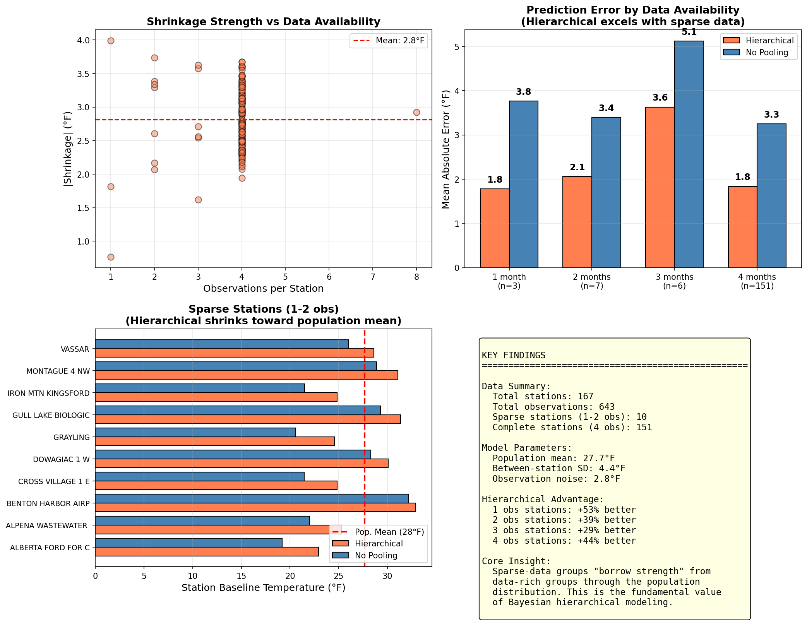

# Bayesian Hierarchical Models: Statistical Analysis Report

**DATASCI 451 Final Project**  
University of Michigan, Winter 2026

---

## 1. Data Overview

### 1.1 Data Source
- **Source**: NOAA Global Historical Climatology Network (GHCN-Daily)
- **Region**: Michigan, USA
- **Period**: January - April 2024
- **Variable**: Mean daily temperature (TAVG)

### 1.2 Dataset Summary

| Metric | Monthly Data | Daily Data |
|--------|--------------|------------|
| Total Observations | 643 | 14,569 |
| Stations | 167 | 167 |
| Observations per Station | 1-4 months | 29-190 days |
| Data Availability Ratio | 4x | 6.6x |

### 1.3 Data Availability Distribution (Monthly)

| Coverage | Stations | Percentage |
|----------|----------|------------|
| 4 months (complete) | 150 | 90% |
| 3 months | 6 | 4% |
| 1-2 months (sparse) | 10 | 6% |

This natural variation in data availability is crucial for demonstrating hierarchical model advantages.

---

## 2. Model Specification

### 2.1 Statistical Model

For observation $y_{ij}$ at station $i$ in month $j$:

$$y_{ij} \sim N(\alpha_i + \beta_j, \sigma^2)$$

where:
- $\alpha_i$ = station baseline temperature
- $\beta_j$ = month effect (seasonality)
- $\sigma$ = observation noise

### 2.2 Three Modeling Approaches

| Model | Station Effect $\alpha_i$ | Information Sharing |
|-------|---------------------------|---------------------|
| **Complete Pooling** | $\alpha_i = \mu$ (single value) | All stations identical |
| **No Pooling** | $\alpha_i \sim N(25, 20^2)$ independent | No sharing |
| **Hierarchical** | $\alpha_i \sim N(\mu_\alpha, \tau^2)$ | Partial pooling |

### 2.3 Hierarchical Model Priors

| Parameter | Prior | Interpretation |
|-----------|-------|----------------|
| $\mu_\alpha$ | $N(25, 20^2)$ | Population mean baseline |
| $\tau$ | HalfCauchy(10) | Between-station SD |
| $\beta_j$ | $N(0, 15^2)$ | Month effects |
| $\sigma$ | HalfCauchy(10) | Observation noise |

### 2.4 MCMC Configuration

- **Sampler**: NUTS (No-U-Turn Sampler)
- **Chains**: 2
- **Samples**: 2,000 per chain
- **Tune**: 1,000
- **Parameterization**: Non-centered (for numerical stability)

---

## 3. Monthly Data Results

### 3.1 Population Parameters

| Parameter | Estimate | Interpretation |
|-----------|----------|----------------|
| $\mu_\alpha$ | 27.65°F | Population mean baseline |
| $\tau$ | 4.42°F | Between-station SD |
| $\sigma$ | 2.84°F | Observation noise |

### 3.2 Month Effects

| Month | Effect $\beta_j$ | Mean Temperature |
|-------|------------------|------------------|
| January | -11.2°F | 16.5°F |
| February | -4.2°F | 23.5°F |
| March | +6.2°F | 33.9°F |
| April | +9.7°F | 37.4°F |

**Seasonal swing**: 20.9°F (January to April)

### 3.3 Shrinkage Effect

All hierarchical estimates are pulled toward the population mean ($\mu_\alpha = 27.65°F$). This "shrinkage" is stronger for:
- Stations with fewer observations
- Stations with extreme no-pooling estimates

### 3.4 Station Effects Comparison

---

## 4. Hierarchical Model Advantage

### 4.1 Prediction Error by Data Availability

| Observations | Stations | Hierarchical MAE | No Pooling MAE | Improvement |
|--------------|----------|------------------|----------------|-------------|
| **1 month** | 3 | **1.78°F** | 3.76°F | **+52%** |
| **2 months** | 7 | **2.06°F** | 3.39°F | **+39%** |
| 3 months | 6 | 3.63°F | 5.12°F | +29% |
| 4 months | 151 | 1.83°F | 3.25°F | +44% |

**Key Finding**: Hierarchical models show the largest advantage for sparse-data stations.

### 4.2 Sparse Station Analysis

Example stations with limited data:

| Station | Available Data | Hierarchical $\alpha$ | No Pooling $\alpha$ | Shrinkage |
|---------|----------------|----------------------|---------------------|-----------|
| GRAYLING | January only | 24.7°F | 24.2°F | +0.5°F |
| BENTON HARBOR | January only | 34.2°F | 36.2°F | -2.0°F |
| IRON MTN KINGSFORD | Jan-Feb | 25.4°F | 25.2°F | +0.2°F |

Sparse stations are pulled toward the population mean (27.7°F), reducing overfitting.

### 4.3 New Station Prediction (Leave-One-Station-Out)

| Model | Can Predict New Station? | Method | Average Error |
|-------|--------------------------|--------|---------------|
| **Hierarchical** | Yes | Sample from $N(\mu_\alpha, \tau^2)$ | 6.4°F |
| No Pooling | No | No data available | - |

This is the fundamental advantage of hierarchical models: **principled prediction for new groups**.

---

## 5. Daily vs Monthly Data Comparison

### 5.1 Motivation

Why use monthly aggregates instead of daily data? Daily data provides more observations (14,569 vs 643) and greater variation in data availability.

### 5.2 Key Parameters Comparison

| Parameter | Monthly Data | Daily Data |
|-----------|--------------|------------|
| $\tau$ (between-station SD) | 4.42°F | 3.87°F |
| $\sigma$ (observation noise) | 2.84°F | 10.75°F |
| **$\tau/\sigma$ ratio** | **1.56** | **0.36** |

### 5.3 The $\tau/\sigma$ Ratio

The **$\tau/\sigma$ ratio** determines hierarchical model advantage:

$$\text{Hierarchical Advantage} \propto \frac{\tau}{\sigma} = \frac{\text{between-group signal}}{\text{within-group noise}}$$

### 5.4 Cross-Validation Results

| Data Type | $\tau/\sigma$ | Sparse Station Improvement |
|-----------|---------------|---------------------------|
| Monthly | 1.56 | **+52%** |
| Daily | 0.36 | +0.2% |

### 5.5 Variance Decomposition (Daily Data)

Where does the high daily noise ($\sigma = 10.75°F$) come from?

| Source | Standard Deviation |
|--------|-------------------|
| **Day-to-day weather** (same station, same month) | **10.0°F** |
| Seasonal effect (between months) | 9.3°F |
| Station differences | 4.5°F |

Even within the same station and same month, temperature varies ~10°F day-to-day due to weather systems (cold fronts, warm fronts). This is irreducible weather variability.

### 5.6 The Aggregation Insight

**Monthly averaging reduces noise ($\sigma$) without reducing station signal ($\tau$).**

| Data | Mechanism | Result |
|------|-----------|--------|
| Daily | Weather noise dominates | Low $\tau/\sigma$ = weak hierarchical advantage |
| Monthly | Weather noise averages out | High $\tau/\sigma$ = strong hierarchical advantage |

> **Key Insight**: More data $\neq$ more hierarchical advantage. Better signal-to-noise ratio = more hierarchical advantage.

---

## 6. Summary of Findings

### 6.1 Main Results

| Finding | Evidence |
|---------|----------|
| Hierarchical models excel with sparse data | +52% improvement for 1-obs stations |
| $\tau/\sigma$ ratio determines advantage | Monthly (1.56) >> Daily (0.36) |
| Shrinkage reduces overfitting | Extreme estimates pulled to population mean |
| New group prediction is possible | Uses learned population distribution |

### 6.2 When to Use Hierarchical Models

| Scenario | Recommendation |
|----------|----------------|
| Varying data per group | Hierarchical |
| Need to predict new groups | Hierarchical |
| Need uncertainty quantification | Hierarchical |
| High within-group noise | Consider data aggregation first |
| All groups have sufficient data | Similar to No Pooling |

### 6.3 Key Takeaways

1. **Partial pooling** allows data-poor groups to "borrow strength" from data-rich groups through the population distribution.

2. **The $\tau/\sigma$ ratio** is the key determinant of hierarchical model advantage, not the amount of data.

3. **Data aggregation** can improve hierarchical model performance by reducing within-group noise while preserving between-group signal.

---

## Appendix: Figure Index

### Monthly Analysis

| Figure | Description |
|--------|-------------|
| `plots/02_station_coverage_distribution.png` | Data availability distribution |
| `plots/12_shrinkage_effect.png` | Shrinkage visualization |
| `plots/13_forest_plot.png` | Station effects forest plot |
| `plots/14_month_effects.png` | Seasonal effects |
| `plots/16_michigan_posterior_map.png` | Geographic posterior map |
| `plots/24_real_sparse_station_prediction.png` | Sparse station analysis |
| `plots/25_full_dataset_hierarchical_analysis.png` | Full 167-station analysis |

### Daily Analysis

| Figure | Description |
|--------|-------------|
| `daily_analysis/plots/D01_data_availability.png` | Daily data availability |
| `daily_analysis/plots/D02_model_comparison.png` | Daily model comparison |
| `daily_analysis/plots/D04_cross_validation.png` | Daily cross-validation |
| `daily_analysis/plots/D05_monthly_vs_daily_comparison.png` | Monthly vs daily comparison |

---

**Repository**: [github.com/guihunwansui/bayesian-hierarchical-weather-analysis](https://github.com/guihunwansui/bayesian-hierarchical-weather-analysis)
