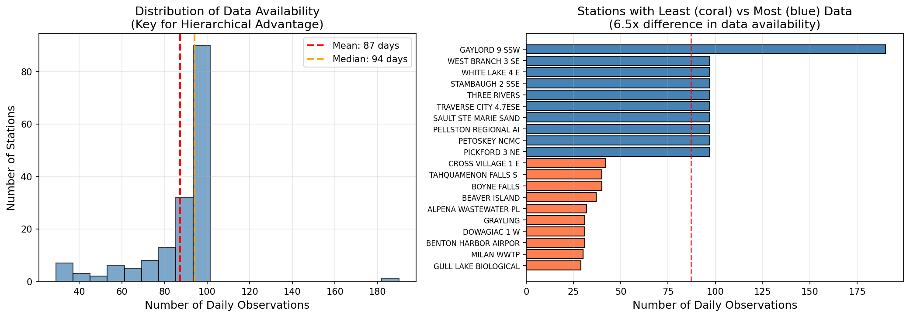
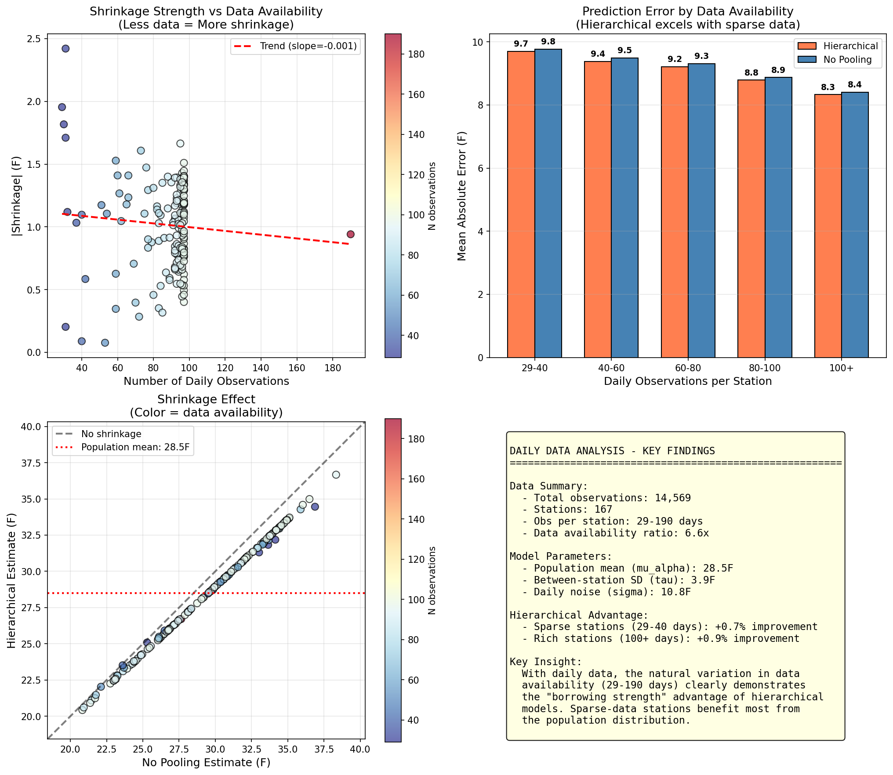
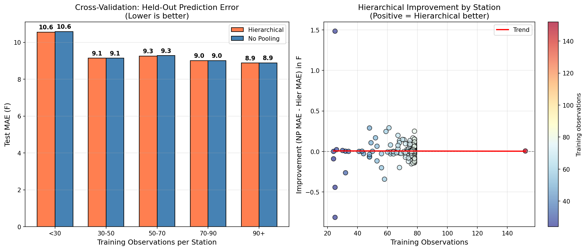
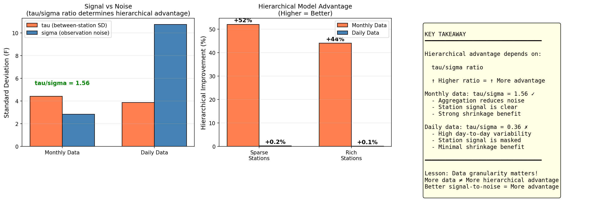

# Daily Data Analysis Report

**DATASCI 451 Final Project - Supplement**

---

## Overview

This analysis uses **daily temperature observations** instead of monthly aggregates to explore hierarchical model behavior with larger datasets and natural variation in data availability.

## Data Summary

| Metric | Value |
|--------|-------|
| Total Observations | 14,569 |
| Stations | 167 |
| Obs per Station | 29-190 days |
| Data Availability Ratio | 6.6x |



## Model Results

### Population Parameters

```
mu_alpha = 28.50 F (population mean)
tau      = 3.87 F  (between-station SD)
sigma    = 10.75 F (daily noise)
```

### Key Finding: tau/sigma Ratio

The **tau/sigma ratio** is crucial for hierarchical model advantage:

| Data Type | tau | sigma | tau/sigma |
|-----------|-----|-------|-----------|
| Monthly | 4.42 F | 2.84 F | **1.56** |
| Daily | 3.87 F | 10.75 F | **0.36** |



## Cross-Validation Results



| Training Obs | Hierarchical MAE | No Pooling MAE | Improvement |
|--------------|------------------|----------------|-------------|
| <30 | 10.56 F | 10.58 F | +0.2% |
| 30-50 | 9.14 F | 9.14 F | -0.1% |
| 50-70 | 9.26 F | 9.28 F | +0.2% |
| 70-90 | 9.00 F | 9.01 F | +0.0% |
| 90+ | 8.88 F | 8.88 F | +0.1% |

## Key Insight: Why Daily Data Shows Less Hierarchical Advantage



**The Paradox Resolved:**

Daily data has MORE observations and MORE variation in data availability, yet shows LESS hierarchical advantage. Why?

1. **Daily noise is much higher** (10.75 F vs 2.84 F)
2. **tau/sigma ratio is lower** (0.36 vs 1.56)
3. **Station signal is masked** by day-to-day weather variability

**Lesson:** Data aggregation (monthly means) actually IMPROVES hierarchical advantage by reducing noise, making the station-level signal more apparent.

## Files Generated

| File | Description |
|------|-------------|
| `data/daily_data_prepared.csv` | Prepared daily data |
| `data/trace_daily_*.nc` | MCMC traces |
| `data/station_results.csv` | Station-level results |
| `plots/D01-D05_*.png` | Visualizations |

## Scripts

| Script | Purpose |
|--------|---------|
| `01_prepare_daily_data.py` | Data preparation |
| `02_fit_models.py` | Model fitting |
| `03_analyze_results.py` | Results analysis |
| `04_cross_validation.py` | Cross-validation |
| `05_summary_comparison.py` | Comparison with monthly |
